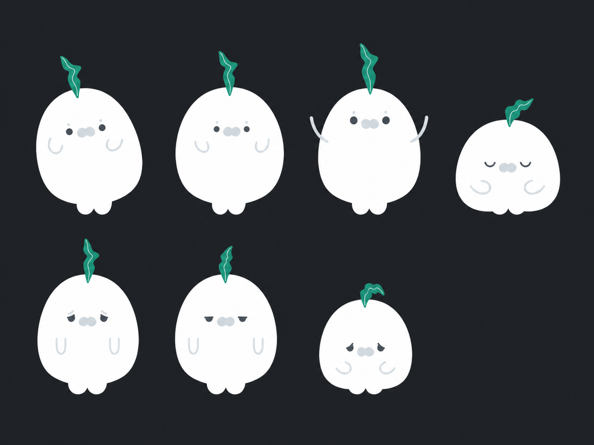

# Pibo 状态形象探索

> 日期：2026-08-14
> 状态：v2 为当前 Image Gen 概念验证，不是生产动画资产



`pibo-seven-states-v1.png` 已废弃：第一次把透明 SVG 通过 Quick Look 栅格化时，白色
身体与白色预览背景融为一体；生成提示词又错误使用了 `no outline-filled torso`，导致
模型只保留悬浮的五官、手臂和头顶火焰。v2 改用完整 Pibo 在深灰背景上的合成参考，
并把实心白色躯干、完整外轮廓和底部双脚设为最高优先级约束。

## 目的

验证健康数据直接影响 Pibo 时，状态能否只靠角色姿态、眼型、身体压缩和头顶火焰形态
被辨认，而不依赖标签、道具、场景或复杂特效。

本板按从左至右、从上至下探索：

1. 数据未知；
2. 稳定；
3. 精力充足；
4. 休息；
5. 疲惫；
6. 无聊；
7. 虚弱。

## 参考真源

- `/Users/trevorlink/Project/PiboWorld/pibo-media/source/character/states/pibo-state-stable-forest-idle.svg`
- `/Users/trevorlink/Project/PiboWorld/pibo-media/source/character/states/pibo-state-tired-forest-idle.svg`
- `/Users/trevorlink/Project/PiboWorld/pibo-media/source/character/states/weak.svg`
- `/Users/trevorlink/Project/PiboWorld/pibo-media/source/character/states/boring.svg`

生成使用内置 Image Gen。v2 以用户确认的完整透明 Pibo PNG 合成深灰参考，官方 SVG
用于核对角色结构；临时参考没有修改生产媒体库或 App 资产。

## 生成提示词

```text
Use case: stylized-concept
Asset type: corrected Pibo mobile game character state exploration sheet, pre-production key-pose board
Input image: Image 1 is the canonical Pibo identity and body-silhouette reference. Preserve this exact character construction.
Primary request: Create one polished state exploration sheet showing the same Pibo in seven clearly distinguishable states: data unknown, stable/normal, energetic, resting/asleep, tired, bored, and weak. Arrange them as a clean 4-by-2 grid with one empty cell, equal scale and generous spacing. Do not add labels; state recognition must come from posture and expression.
Critical body invariant: EVERY state must include Pibo's complete, large, solid-white soft body silhouette. The body is a nearly circular pear-shaped blob, slightly wider through the middle, with a subtly irregular organic contour and exactly two small rounded white feet protruding at the bottom center. The white torso occupies most of the character height and must never disappear, become transparent, fragment into floating facial features, or be replaced by outlines. There is no dark stroke around the body; visibility comes from strong contrast against the dark background. The full outer edge of the torso and both feet must be clearly visible in every cell.
Face and head invariants: two simple dark-charcoal eyes; two tiny pale-gray forehead dots; one small pale-gray double-lobed nose/muzzle; two pale-gray U-shaped arms drawn on top of the white body; exactly one organic green flame/leaf growing from the top center of the head with a thin white inner vein. No ears, tail, clothing, fur, fingers, mouth, eyebrows, accessories, or extra facial features.
Pose direction: data unknown is upright but gently uncertain with a slight head/body tilt; stable matches the canonical calm front-facing pose; energetic is upright and expanded with lifted U-shaped arms, bright open eyes, and a more vertical lively green flame, but no props or effects; resting is peacefully compressed or curled with closed eyes while the full white body remains visible; tired has heavy eyelids, lowered arms and a gently sagging body; bored is inactive with flat eyes and relaxed arms, distinct from sadness; weak is visibly depleted and compressed with a drooping flame, but clearly alive and recoverable, not injured or dying.
Scene/backdrop: uniform matte dark charcoal #202428 across the entire canvas, no white panels, no frames, no floor, no shadows, no gradients, no texture.
Style/medium: clean flat vector-like design using sparse geometric shapes and crisp edges, matching the reference exactly; production animation key-pose reference rather than generic mascot art.
Composition: one complete full-body Pibo per cell, consistent scale and anchor point, no cropping, no overlap.
Constraints: seven Pibos total; all seven bodies fully visible; no text, numbers, legends, icons, sparkles, decorations, glow, watermark, or extra objects. Do not redesign the character. The solid white body silhouette is the highest-priority requirement.
```

## 使用边界与下一步

- 此图用于选择状态语言，不直接切图进入 App；
- 生产状态应回到 `pibo-media/source/character/states/`，以独立 SVG 和统一锚点实现；
- 现有疲惫、无聊、虚弱和睡眠资产优先复用；
- 当前真正需要新增并验证的是“精力充足”常驻状态；
- 确认造型后，再生成该状态的独立关键姿态，随后人工整理为向量和转场。
